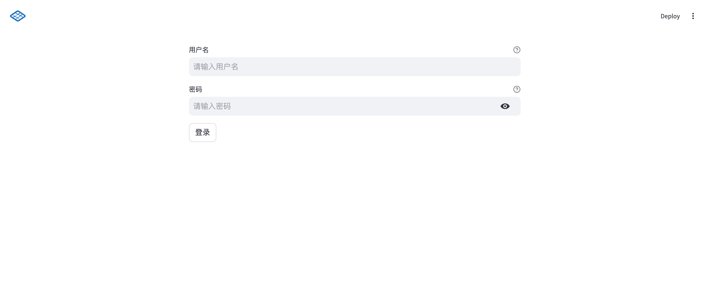
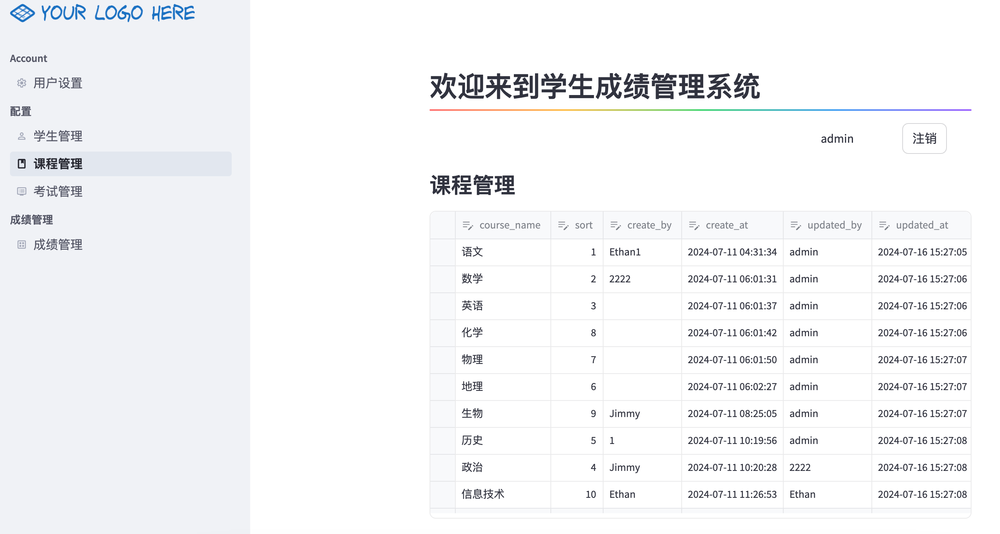
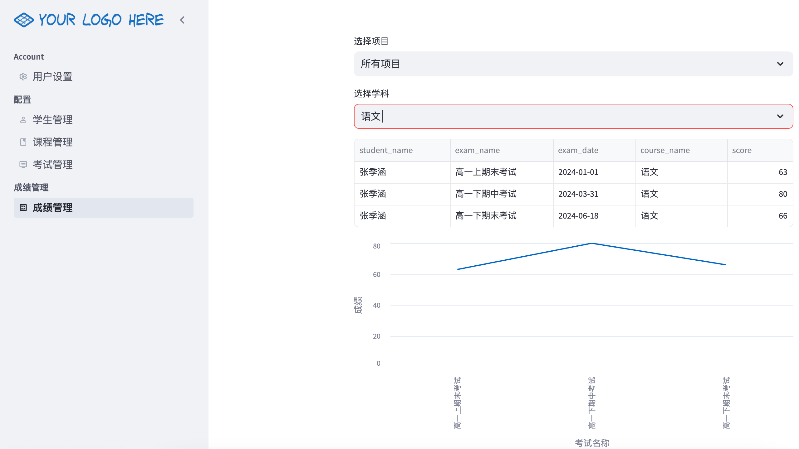

<!--
 * @Author       : JIYONGFENG jiyongfeng@163.com
 * @Date         : 2024-07-17 09:20:23
 * @LastEditors  : JIYONGFENG jiyongfeng@163.com
 * @LastEditTime : 2024-07-17 09:32:10
 * @Description  :
 * Copyright (c) 2024 by ZEZEDATA Technology CO, LTD, All Rights Reserved.
-->

# 学生成绩管理系统

基于 streamlit 的 web 应用，自家孩子方便进行考试成绩的录入、查询、修改、删除和统计功能。

## 1. 已实现功能

### 用户登录

实现简单的用户登录功能，账户、密码保存在 secrets.toml 文件中。

### 基本管理

1. 学生信息的增删改查功能。
2. 课程信息的增删改查功能。
3. 考试信息的增删改查功能。

### 成绩管理

1. 学生成绩的录入、查询、修改、删除功能。
2. 课程成绩的展示功能。

## 2. 待实现功能

1. 课程成绩的统计功能。
2. 数据库的备份和恢复功能。
3. 支持多个用户登录的功能。
